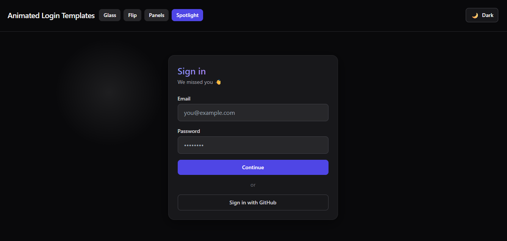

# ✨ Animated Login Templates

A collection of beautiful, **animated login & signup form templates** built with **React + Tailwind CSS + Framer Motion**.

This project is perfect for developers and designers who want **modern, interactive authentication UIs** — from glassmorphism and card flips to elegant sliding panels and spotlight effects.

---

------Live Demo:------
https://animated-login-templates.netlify.app

## 🌈 Features

- 🌓 **Light & Dark themes** — instantly switch between both.
- ⚡ **Framer Motion animations** — smooth, performant transitions.
- 🎨 **Tailwind CSS design system** — easy to customize.
- 💡 **Reusable components** — each template is standalone.
- ⚙️ **Vite + TypeScript** setup for lightning-fast development.

---

## 🖼️ Screenshots

| Template | Preview |
|-----------|----------|
| **GlassAurora** |  |
| **CardFlip** |  |
| **SlidingPanels** |  |
| **SpotlightHover** |  |


---

## 📁 Templates Included

| Template | Description |
|-----------|-------------|
| **GlassAurora** | Elegant glassmorphism-style login form with soft, subtle color accents. |
| **CardFlip** | 3D animated card that flips between login and signup forms. |
| **SlidingPanels** | Dual-panel layout with animated slide-in transitions. |
| **SpotlightHover** | Interactive spotlight that follows the mouse cursor. |

---

## 🚀 Getting Started

### 1️⃣ Clone the repository
```bash
git clone https://github.com/<your-username>/animated-login-templates.git
cd animated-login-templates

2️⃣ Install dependencies
npm install
# or
yarn install

3️⃣ Run the development server
npm run dev


Then open http://localhost:5173
 in your browser.

 🧱 Project Structure
animated-login-templates/
│
├── src/
│   ├── components/
│   │   ├── templates/
│   │   │   ├── GlassAurora.tsx
│   │   │   ├── CardFlip.tsx
│   │   │   ├── SlidingPanels.tsx
│   │   │   ├── SpotlightHover.tsx
│   │   │   └── index.ts
│   │   ├── ThemeToggle.tsx
│   │   └── ...
│   ├── App.tsx
│   ├── main.tsx
│   └── theme/
│       └── ThemeProvider.tsx
│
├── screenshots/
│   ├── light-mode.png
│   ├── dark-mode.png
│   ├── glass-aurora.png
│   ├── card-flip.png
│   ├── sliding-panels.png
│   └── spotlight-hover.png
│
├── package.json
├── vite.config.ts
└── tailwind.config.js


🧩 Customization

You can easily tweak:

-Colors: adjust Tailwind color classes or gradients.

-Animations: modify Framer Motion transitions (duration, stiffness, etc.).

-Layout: adjust spacing, radius, or shadows with Tailwind utilities.


⚙️ Configuration

-Tailwind uses darkMode: 'class' in tailwind.config.js.

-The ThemeProvider handles theme state and persistence.

-All templates are modular, so you can import any of them directly:

import { CardFlip } from "@/components/templates";

🖋️ License

Licensed under the MIT License — free for personal and commercial use.
Built with ❤️ by Fadi Srour


⭐ Contribute

Pull requests and new template ideas are welcome!
To add a new animation:

1-Create a new component under src/components/templates/.

2-Export it in index.ts.

3-Open a pull request!

